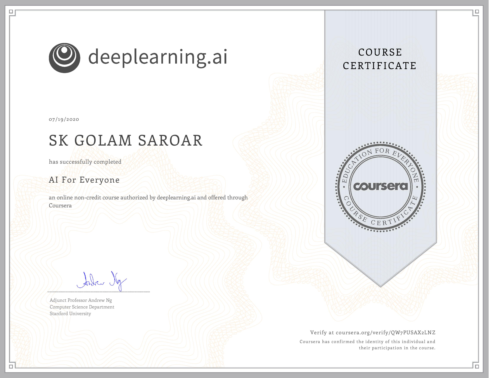

## AI For Everyone, by deeplearning.ai on Coursera

This [course](https://www.coursera.org/learn/ai-for-everyone) covers the following:  
- The meaning behind common AI terminology, including neural networks, machine learning, deep learning, and data science
- What AI realistically can, and cannot do
- How to spot opportunities to apply AI to problems in your own organization
- What it feels like to build machine learning and data science projects
- How to work with an AI team and build an AI strategy in your company
- How to navigate ethical and societal discussions surrounding AI

Below are my notes (albeit very brief) from this course.

### Types of AI

1.  ANI (Artificial Narrow Intelligence)
2.  AGI (Artificial General Intelligence)

### Why the rise in Supervised ML?

1.  More data available now
2.  Deep Neural Network (enabled by superior computational power)

### Acquiring Data

1.  Manual labeling
2.  From observing behaviors (for example, website database)
3.  Download from web/partnerships

### Data Problems:

1.  Incorrect labels
2.  Missing values
3.  Multiple types of data (images, audio, text- unstructured data)

Machine learning often results in a running AI system. So, if you have
an AI system running, serving dozens or hundreds of thousands of
millions of users, that's usually a machine-learning system. In
contrast, the output of a data science project is a set of insights that
can help you make business decisions, such as what type of house to
build or whether to invest in renovation.

Let’s see an example of machine learning versus data science in the
online advertising industry. Today, to launch our platforms, we have a
piece of AI that quickly tells them what's the ad you are most likely to
click on. So, that's a machine learning system. This turns out to be an
incredibly lucrative AI system that takes as input information about you
and about the ad and outputs whether you are going to click on this or
not. These systems are running 24-7. In contrast, if analyzing data
tells you, for example, that the travel industry is not buying a lot of
ads, but if you send more salespeople to sell ads to travel companies,
you could convince them to use more advertising, then that would be an
example of a data science project.

### AI Transformation

1.  Execute pilot projects to gain momentum
2.  Build an in-house AI team
3.  Provide broad AI training
4.  Develop an AI strategy
5.  Develop internal and external communication

### ML tends to work well when:

1.  Learning a simple concept (which takes around 1 second of thought)
2.  Lots of data available

### ML tends to work poorly when:

1.  Learning complex concepts from small amounts of data
2.  It is asked to perform on new types of data

### Key steps of an ML project

1.  Collect data
2.  Train Model (iterate many times until good enough)
3.  Deploy model (get feedback, update model)

### Key steps of a Data Science project:

1.  Collect data
2.  Analyze data (iterate many times to get good insights)
3.  Suggest hypothesis/actions (deploy changes, re-analyze new data
    periodically)

### Brainstorming Framework

1.  Try to automate tasks, instead of jobs
2.  What are the main drivers of business value
3.  What are the main pain points in your business

### A few applications of AI:

#### Computer Vision:

1.  Image Classification/Object Recognition (ex: face recognition)
2.  Object Detection
3.  Image Segmentation
4.  Tracking

#### Natural Language Processing:

1.  Text Classification (ex: sentiment recognition)
2.  Information Retrieval (ex: web search)
3.  Named Entity Recognition
4.  Machine Translation

#### Speech:

1.  Speech Recognition (speech-to-text)
2.  Trigger word/wake word detection
3.  Speaker ID
4.  Speech Synthesis (text-to-speech)

AI Research publications: Arxiv

At the end of this course, I believe I am equipped with the right attitude to AI projects, it's power and limitation, and how it will affect our society/jobs. Oh, I also have this certificate now... 

